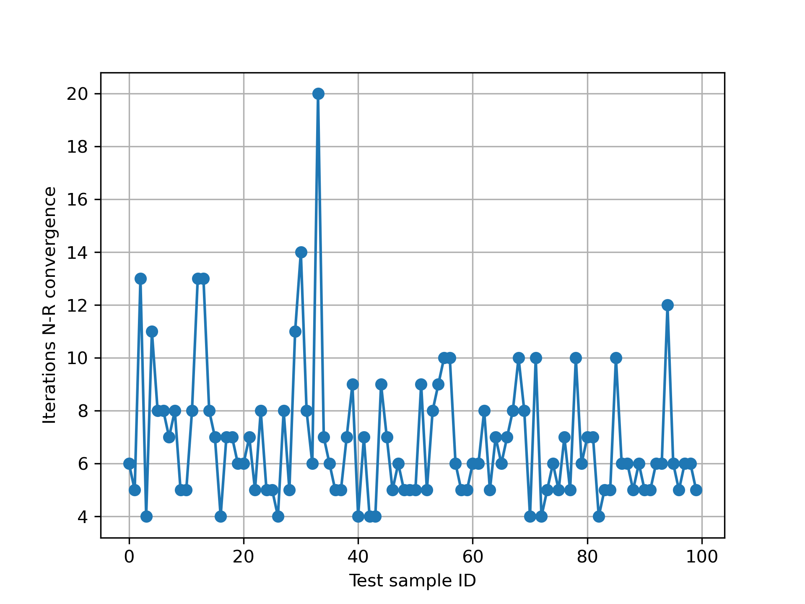

Welcome to the physics-informed unsupervised learning approach (authored by Shengyuan Yan, TU/e)

To reproduce the results in our paper/technical report, follow the steps below.

1, Install the same environment as already indicated in the RL (Reinforcement Learning) approach in the root directory of this Github repository.

2, Download the entire folder named "Physics-informed unsupervised learning approach" in the root directory of this Github repository.

3, In the downloaded folder you will find a numpy array file named "vector_data.npy". This is the training dataset. This data file is the same one as the "vector_data.npy" in the folder "grid_dataset" in the root directory of this Github repository.

4, Enter the downloaded folder and open the script "PINN_unsupervised_learning_approach.py", you will see three options at the beginning of the script:

   supervised=0
   
   semisupervised=0
   
   unsupervised=1

assign value 1 to one of the three options while assigning 0 to all other options to choose one learning scheme from the three. Please note! You can only set one of them to be 1. All other unchosen options must be set to 0. If you set multiple options as 1 simultaneously, the following priority rank will be applied:

   unsupervised learning > semisupervised learning > supervised learning

5, After choosing the learning scheme option, run the script "PINN_unsupervised_learning_approach.py":
   python3 PINN_unsupervised_learning_approach.py

6, The script "PINN_unsupervised_learning_approach.py" will print the loss value progress and best model validation loss during training process. After the training, the script will subsequently print the number of iterations for convergence, MAE(V), MAE(theta), and Power Flow (PF) equation residual values for each test sample using the inference result with each test sample as input of the trained neural network as the initial guess of Newton-Raphson method. There are totally 100 test sample to be printed. Next, the script will print the same information also for each sample but using zeros as the initial guess of Newton-Raphson method. At the end, the script will print the average value of these metrics for both initial guess as the output of neural network and zeros. Last but not least, the script will also save the iterations for Newton-Raphson method to converge with the output of neural network as the initial guess for all test samples as a numpy array file "Test_sample_N-R_iterations.npy" and also will save the iterations for Newton-Raphson method to converge with zero as the initial guess as a numpy array file "Test_sample_N-R_iterations_zero.npy".

7, At last, run the script "TestResultPlot.py", the script will produce a line plot for "Test_sample_N-R_iterations.npy" as the png image file "Iterations_N-R_convergence_testset.png".

## License

This subproject is licensed under the MIT License.  
© 2025 Shengyuan Yan, TU/e. See the [LICENSE](./LICENSE) file for details.
